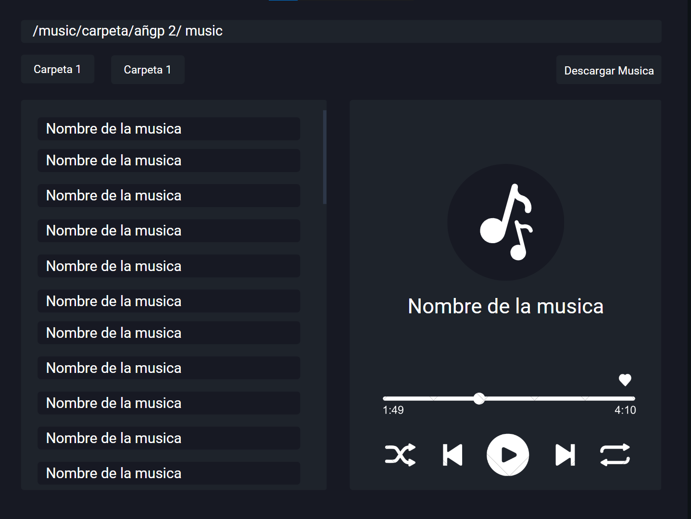

<h1> ElectronPlayer</h1>
<br>

```js
    npm i // Instalacion de dependencias
    cd client && npm run dev //inicia el cliente Vite + typescript
    npm start // inicia el proyecto de electron (renderiza el cliente Vite)
```

#

<br>
<p>ElectronPlayer es un reproductor de musica, lee el directorio "/Music" y muestra una lista de las musicas y carpetas en ese directorio, tambien permite descargar musica directamente de YouTube utilizando la URL</p>

<br>

- Bocetos de como quedaria el programa con estilos (puede modificarse) - 24/02/2023


<br>


Link de la [app](https://www.mediafire.com/file/qlwmo4ua3h2wf28/ElectronPlayer_Setup_1.0.0.exe/file)
